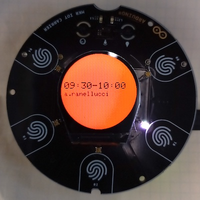
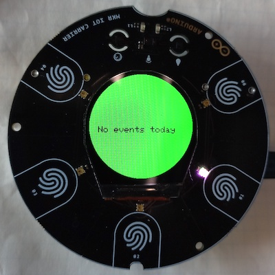

# Meeting Room Occupancy Display 🚥

This little Arduino project is useful for those offices that have meeting rooms that people should book from Google Calendar. What happens in reality is that people often occupy rooms on the fly as booking would take too much time and an empty room in front of you is sooo inviting. This leads to overlaps and, well, ~~vengeful~~ negative feelings. 🧘🏻‍♂️

With this solution you can just install an [Arduino Oplà](http://store.arduino.cc/opla-iot-kit) next to the door and have it show whether the room is free or not based on live data coming from Google Calendar.

## How to install it

1. Open Google Calendar and subscribe to the calendars of the room you want to display. This can be done clicking the "+" button on the left sidebar and selecting "Browse resources".
2. Copy the resource ID of the room. It has the form of an e-mail address in the `...@resource.calendar.google.com` format.
3. Go to https://script.google.com/, create a new project and paste the code from [MeetingRooms.js](MeetingRooms.js). Remember to configure the settings at the beginning of the script.
4. Use the "Deploy" button in Google Apps Scripts and create a "Web app" deployment. Copy the deployment URL.
5. Copy the contents of config.h-dist into a new file called config.h inside [opla-meeting-room](opla-meeting-room).
6. Open the [opla-meeting-room](opla-meeting-room) sketch with the Arduino IDE.
7. Configure the various settings in config.h.
8. Upload the sketch to your Arduino Oplà.
9. Enjoy!

Bonus points: if you want to be able to update the firmware via WiFi, thus without connecting a USB cable, just use the [Arduino Cloud](https://cloud.arduino.cc). It can be set up in minutes and it's quite handy if you have multiple devices installed around.

## How does it look like

(Yeah, these pictures are very ugly. Sorry.)

When the room is busy the screen will be red, and information about the current meeting will be displayed (time slot and guests):

When the room is free but a meeting is scheduled, it will appear green and contain information about the upcoming meeting:

When no more meetings are scheduled for the current day, it will appear green with a generic message:

